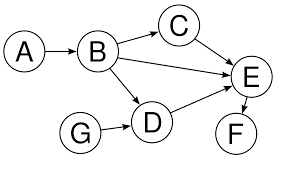
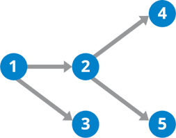

# Concurrent Dependency Graph

https://mybinder.org/v2/gh/swidoff/interview-dag.git/master?filepath=dag.ipynb

## Details

* Nodes are tasks to be executed
* Edges are dependencies between tasks.

## Requirements

* Tasks must execute in dependency order 
     * A must complete before B begins and B
     * C and D must complete before E begins

* Tasks should execute concurrently when possible 
     * After 1 completes, 2 and 3 can execute concurrently
     * After 2 completes, 4 and 5 can execute concurrently (even if 3 hasn’t completed)
